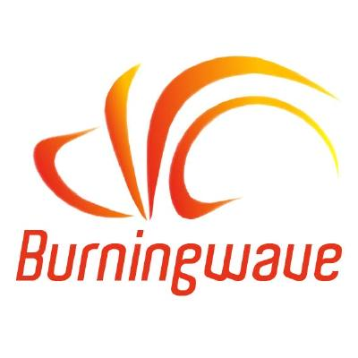

**Burningwave Core** is a fully indipendent, advanced, free and open source Java frameworks building library that contains **THE MOST POWERFUL CLASSPATH SCANNER** for criteria based classes search.
It’s possible to search classes by every criteria that your immagination can made by using lambda expressions. **Scan engine is highly optimized using direct allocated ByteBuffers to avoid heap saturation; searches are executed in multithreading context and are not affected by “_the issue of the same class loaded by different classloaders_”** (normally if you try to execute "isAssignableFrom" method on a same class loaded from different classloader it returns false).

**Tested on Java versions ranging from 8 to 14, Burningwave Core is also useful for creating classes during runtime, facilitate the use of reflection and much more...**

## [Get started](https://github.com/burningwave/core/wiki)
## [Join community](https://www.burningwave.org/forum/)

